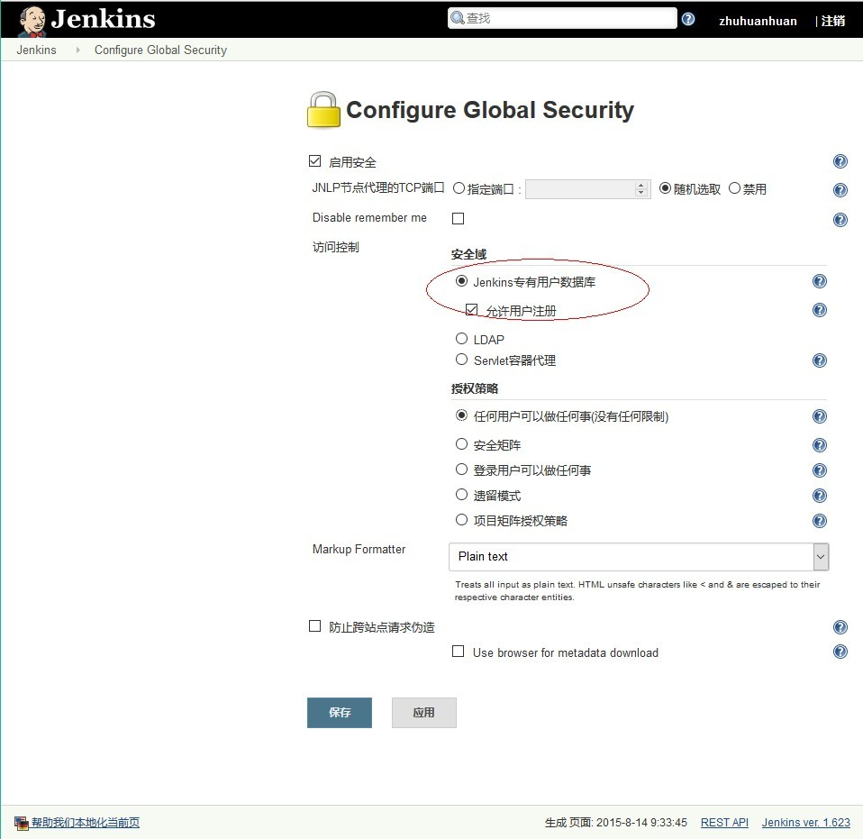
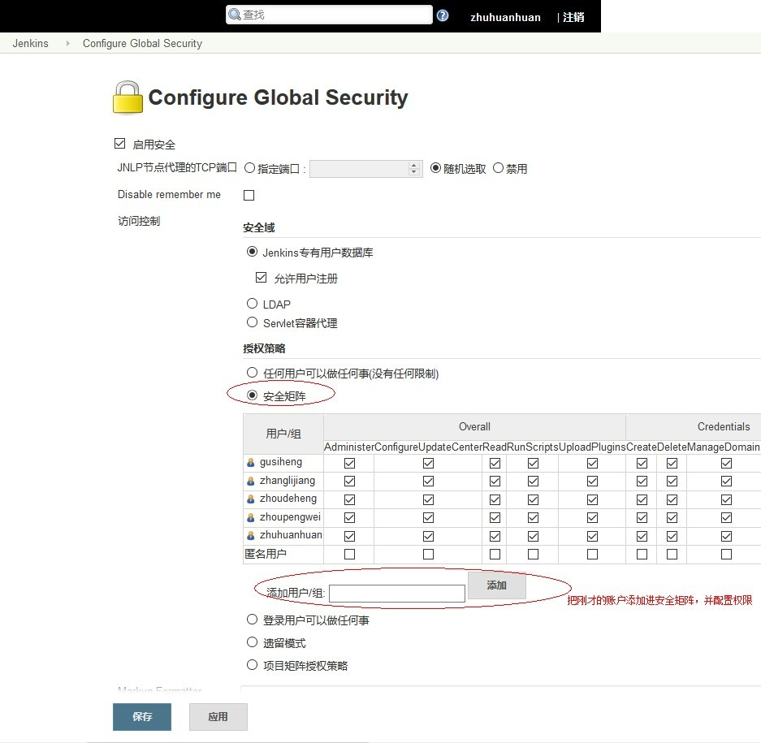
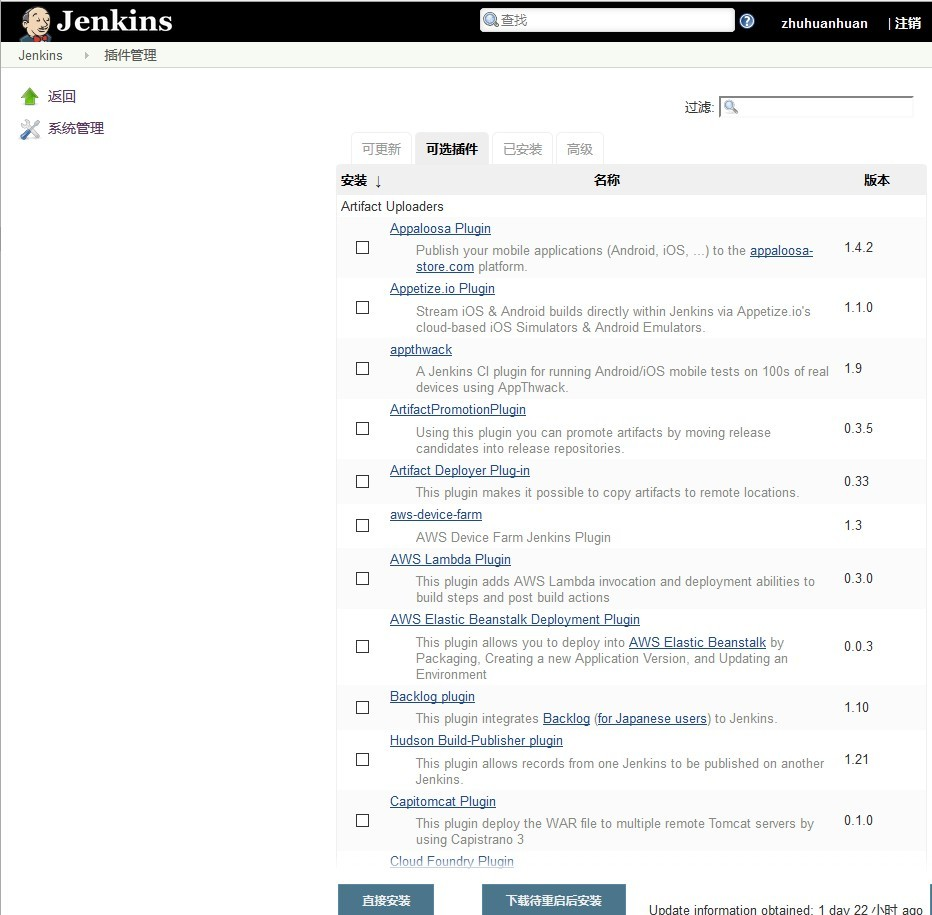
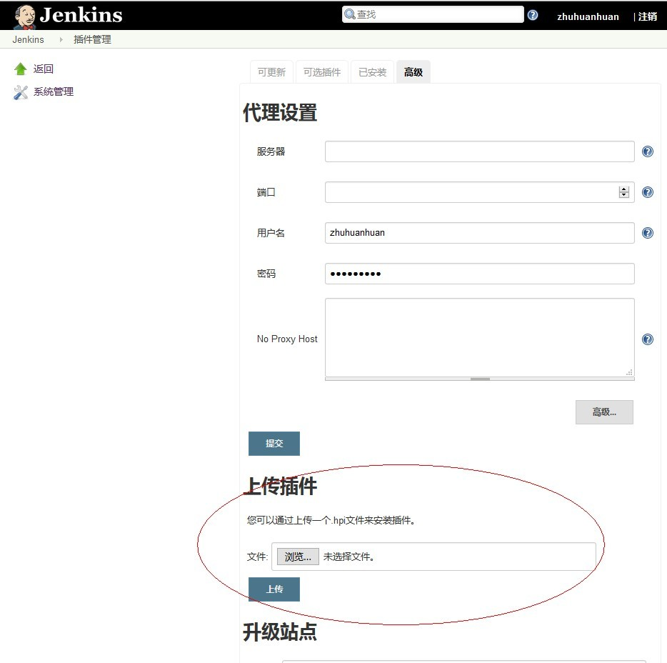
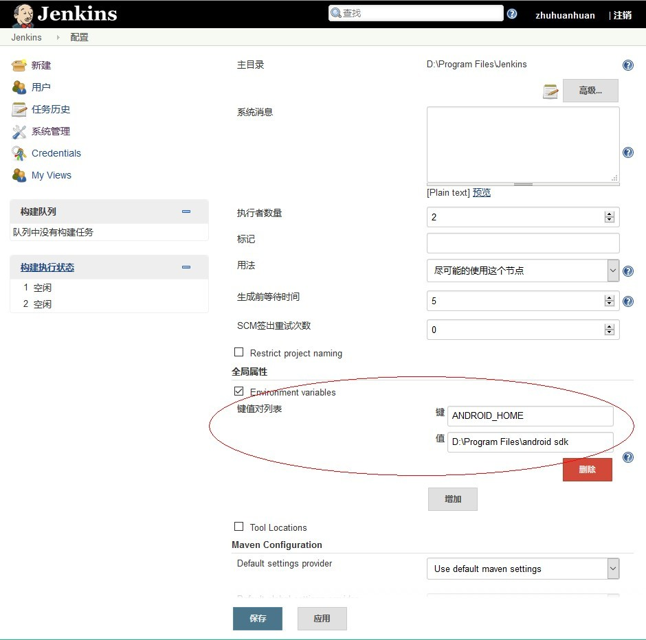
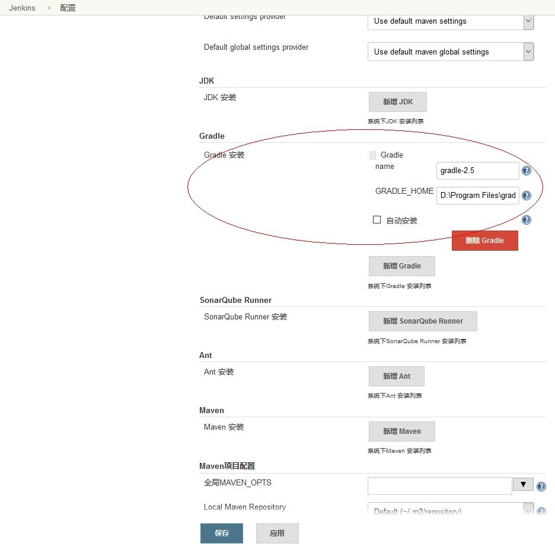
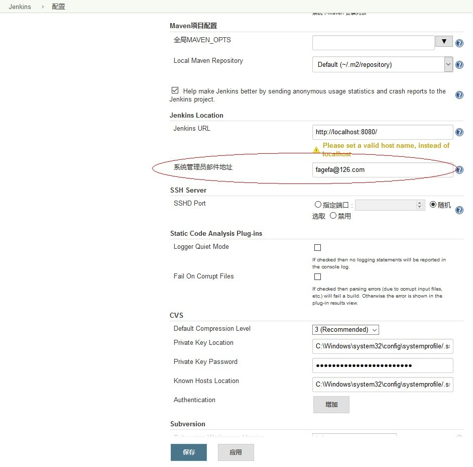
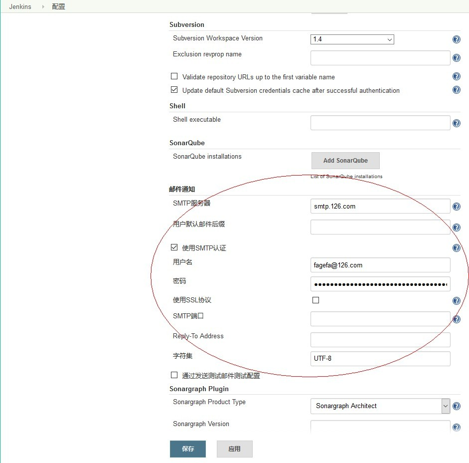
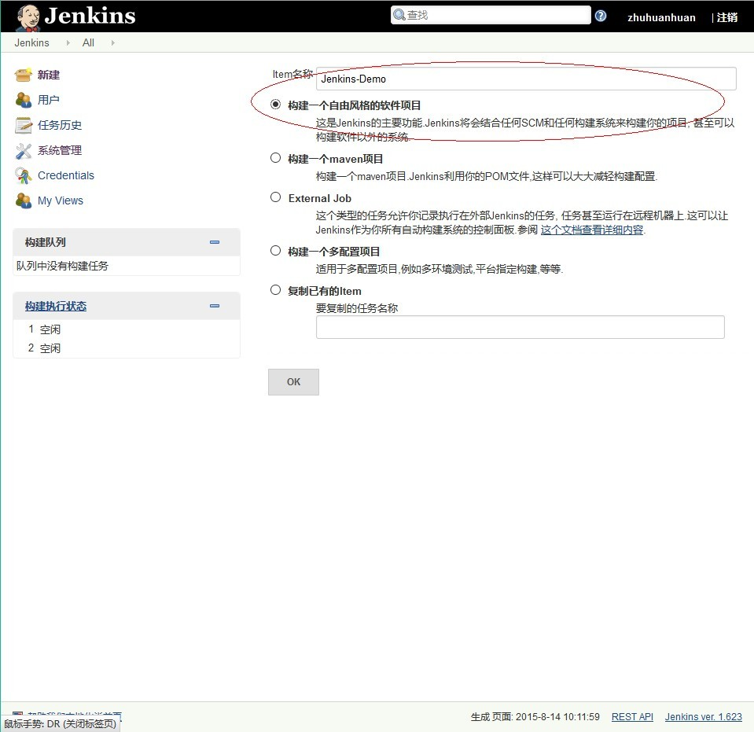
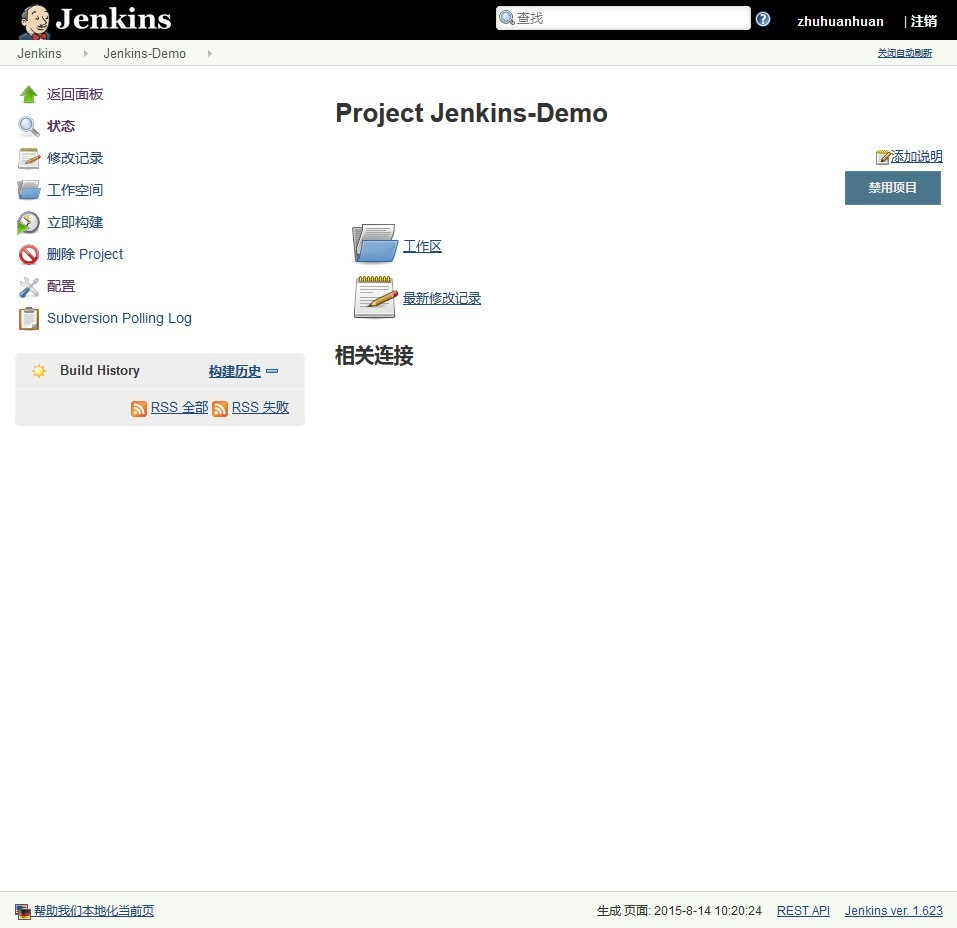

# jenkins配置
## 版本说明
* 作者：竺欢焕（android）
* 所属团队：特维轮无线团队
* 版本：1.0.0

## jenkins下载与安装
* 去官网下载最新版本的jenkins，各个系统下载对应的版本

## jenkins基本配置
### 打开允许注册功能
* 路径：首页--系统管理--Configure Global Security
*  
* 点击“应用”，注册自己的账户

### 账户权限控制
* 路径：首页--系统管理--Configure Global Security
* 
* 点击“应用”

### 插件下载与安装
* 路径：首页--系统管理--管理插件
* 
* 分别安装：svn，gradle，android-lint
* 如果某个插件安装失败，或者连接网络失败，排除依赖其他插件问题后，下载该插件的.hpi文件，手动上传安装
* 

### 系统配置
* 路径：首页--系统管理--系统设置
* 
* 
* 
* 
* 点击“应用”

### 新建任务
* 路径：首页--新建
* 
* 点击“OK”
* 具体的项目配置请参考我的jenkins服务中的配置:http://172.16.1.245:8080
* 