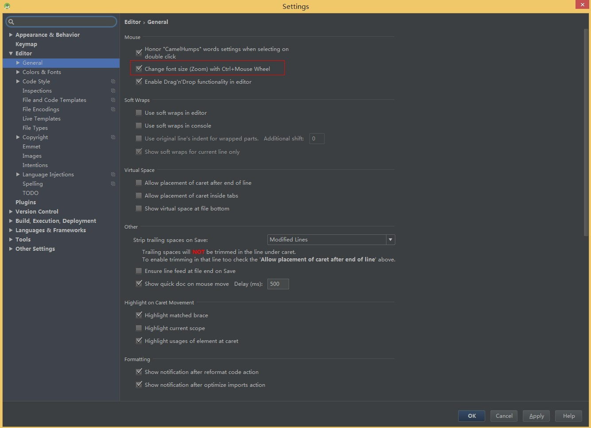

# android studio配置
## 版本说明
* 作者：竺欢焕（android）
* 所属团队：特维轮无线团队
* 版本：1.0

## 说明
* 本文档的所有截图都来自系统设置（路径：File--Settings）
* 如果找不到对应的截图界面，请在左边的搜索框输入需要搜索的文字

## sdk，jdk以及ndk设置
* 如下图
*  

## gradle设置
* 如下图
* 

## 字体编码--UTF-8
* IDE Encoding, Project Encoding以及Default encoding for properites files，都设置成UTF-8
* 

## 字体
* 先save as一个新的Scheme，然后选择一个自己喜欢的字体，字体大小，以及line spacing
* 

## 快捷键的设置
* 推荐使用默认的
* 

## 代码模板
* 创建新的java文件时，自动生成类文件说明文档
* 

## auto import
* 编写代码时，有时候需要手动import一些类，这个设置可以偷懒
* 

## 代码提示，忽略大小写
* 输入代码时，默认设置为首字母相同，比如String类，首字母必须以大写的S开头，忽略大小写后，就没有关系了，直接输入string就行
* 

## 代码行数显示
* 在show line numbers的前面打勾
* 

## 放大字体快捷键
* 在change font size的前面打勾
* 

## 代码提示
* 鼠标放到某个函数或者某个类，自动提示注释的内容（搜索框内输入：“quick doc”）
* 

## IDE更新
* 设置更新通道，喜好稳定版的选stable版；喜好beta版的，选beta版
* 

## svn设置
* IDE集成了svn的版本控制，复制并粘帖svn的可执行文件的绝对地址
* 

